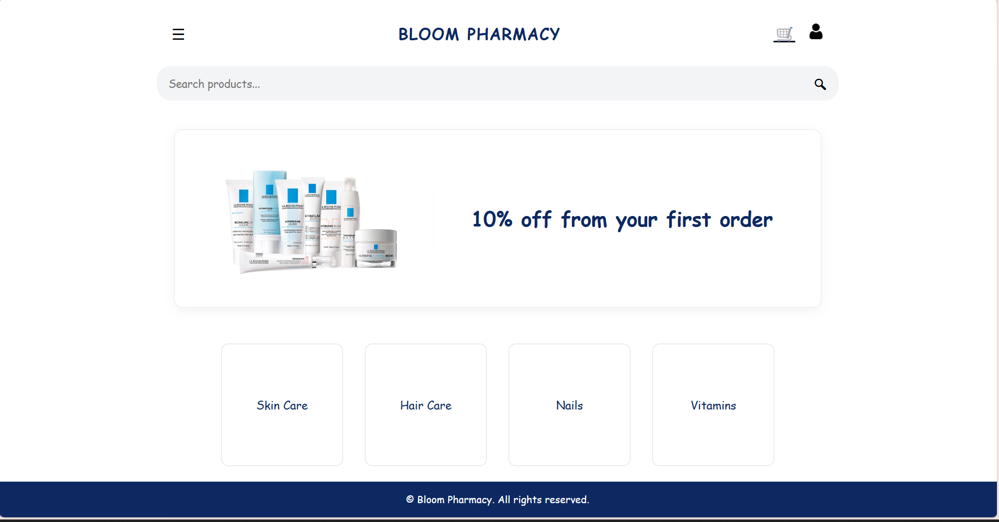
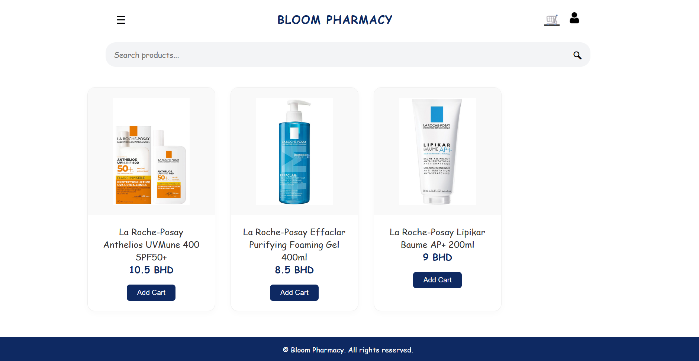
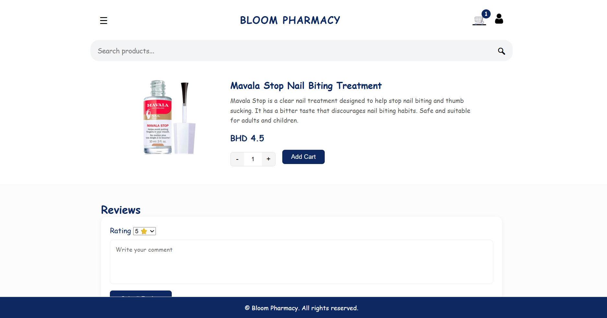
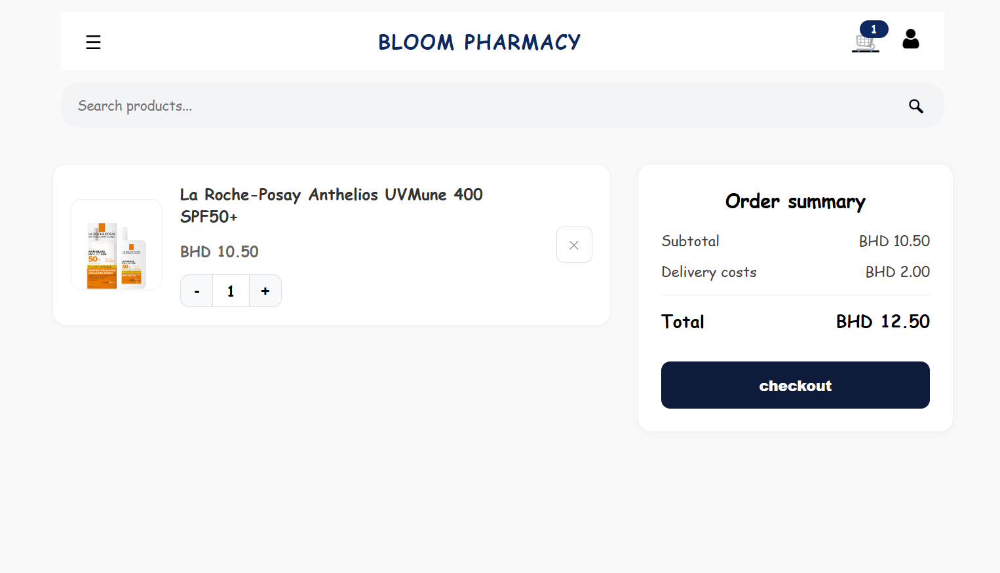
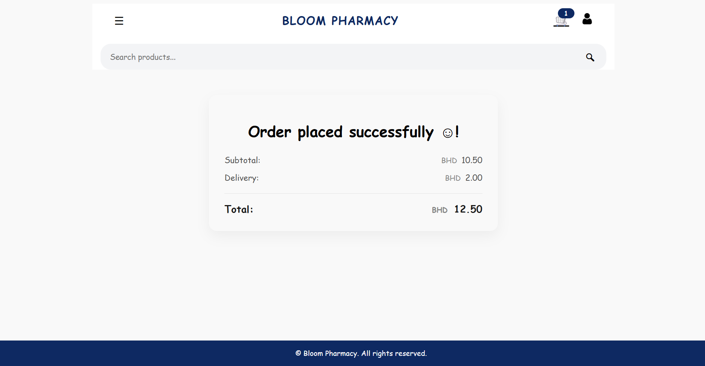

# BLOOM PHARMACY

## Date: 2/26/2026

### By: FATEMA ALNAJJAS & YASMIN EBRAHIM

#### Links:
[GitHub - Fatema](https://github.com/Fatii78) | [LinkedIn - Fatema](https://www.linkedin.com/in/fatema-alnajjas-a57198228)
[GitHub - YASMIN](PUT_TEAMMATE_GITHUB_LINK_HERE) | [LinkedIn - YASMIN] ()
***

## ***Description***

#### Bloom Pharmacy is a full-stack web application that allows users to browse pharmacy products, explore categories, manage their cart, add products to favorites, write reviews, and track their orders.

#### The platform provides a smooth and user-friendly shopping experience while maintaining a structured backend for product and order management.

***

## ***Technologies Used***

* Node.js
* Express.js
* MongoDB
* Mongoose
* EJS
* Express Session
* JavaScript
* CSS

***

## ***Getting Started***

##### 1. User creates an account or signs in.
##### 2. Browse products from categories.
##### 3. Add items to cart.
##### 4. Submit reviews for purchased products.
##### 5. Place an order.
##### 6. View order history in “My Orders”.

##### The project was deployed and can be viewed here:
[Live Demo](PUT_DEPLOYED_LINK_HERE)

***

## ***Screenshots***

***

## ***Future Updates***

- [ ] Online payment integration
- [ ] Admin dashboard
- [ ] Advanced filtering & search
- [ ] UI improvements and animations

***

## ***Team Contributions***

###  Fatema Alnajjas
- DATABASE
- HOME PAGE
- PRODUCTS PAGE
- CART PAGE
- SUCCESS ORDER PAGE

###  YASMIN EBRAHIM
- DATABASE
- HOME PAGE (SIGN-IN, SIGN-UP, SIGN-OUT)
- SHOW PAGE (REVIEW COMMENTS)
- AUTH PAGE
- CSS - CONTROLLER - ROUTER PAGE
***

## ***Credits***

Markdown Guide: https://ia.net/writer/support/general/markdown-guide
Markdown Cheatsheet: https://guides.github.com/pdfs/markdown-cheatsheet-online.pdf
